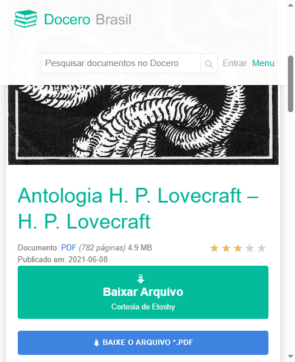

# Doceru Userscript - Downloader para Docubra, Docer.ar e Doceru

Scripts de Tampermonkey para facilitar o download de documentos dos sites:

* [docubra.com](https://docubra.com)
* [docer.ar](https://docer.ar)
* [doceru.com](https://doceru.com)

Estes scripts adicionam um botão de **“Baixar Arquivo”** diretamente na página do documento, com progresso e nome do arquivo personalizado.

---

## ✅ Funcionalidades

* Detecta automaticamente o link de download real.
* Mostra barra de progresso durante o download.
* Adiciona um botão visível e acessível diretamente na interface.

---

## 🖼️ Exemplos Visuais

### 📄 docer.ar / docubra.com

Botão adicionado pelo script:

### 📑 doceru.com

Botão com ícone e progresso:

---

## 🚀 Como Instalar

### 1. Instalar o **Tampermonkey**

O Tampermonkey é uma extensão de navegador que permite instalar scripts de usuário.

* [🦊 Firefox](https://addons.mozilla.org/pt-BR/firefox/addon/tampermonkey/)
* [🌐 Chrome/Edge/Opera](https://www.tampermonkey.net/)

Clique no link acima correspondente ao seu navegador e instale a extensão normalmente.

---

### 2. Instalar os scripts

#### Script para `docer.ar` e `docubra.com`

🔗 Instalar via Tampermonkey:

* [Clique aqui para instalar o script `docubra.js`](./docubra.js)

#### Script para `doceru.com`

🔗 Instalar via Tampermonkey:

* [Clique aqui para instalar o script `doceru.js`](./doceru.js)

> 💡 **Dica**: Você pode abrir os arquivos manualmente no navegador após instalar o Tampermonkey, e ele oferecerá instalar o script automaticamente.

---

## 📘 Uso

1. Acesse qualquer link de documento nos sites mencionados.
2. Aguarde a página carregar.
3. Um botão chamado **“Baixar Arquivo – Cortesia de Etoshy”** será exibido.
4. Clique no botão para iniciar o download com progresso e nome amigável.

---

## 🛠️ Desenvolvimento

Scripts escritos por **Etoshy**, focados em interceptação de requisições `fetch` e `XMLHttpRequest` para capturar a URL de download sem depender do botão nativo dos sites.

---

## ⚠️ Aviso

Esses scripts são para fins educacionais. Use com responsabilidade e respeite os termos de uso dos sites.
